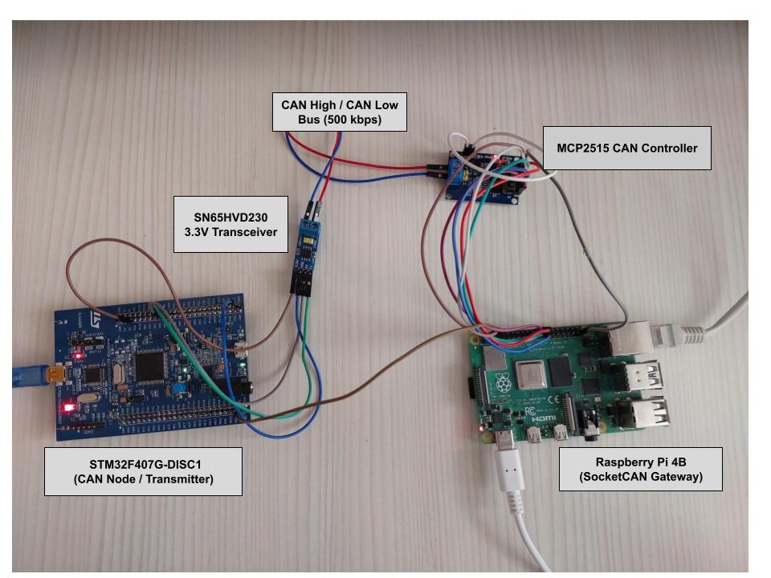

# Distributed Real-Time CAN Bus Gateway & Telemetry Node

A high-performance embedded systems project demonstrating end-to-end Controller Area Network (CAN 2.0A) communication between an ARM Cortex-M4 microcontroller and an embedded Linux gateway, featuring real-time deserialization and hardware-level signal integrity.

## 📌 Project Overview & Architecture
This testbench simulates an automotive/industrial distributed network:
* **STM32F407 (Node / ECU):** Generates periodic sensor telemetry (float temperature, uint32 counter) and transmits standard frames over CAN1.
* **Raspberry Pi 4B (Gateway):** Interfaces with the physical bus via MCP2515 (SPI), manages the kernel-level SocketCAN interface (`can0`), and executes a C++ multi-threaded engine to parse and validate incoming payloads in real time.

```text
+---------------------+       CAN Bus (500 kbps)       +----------------------+
|  STM32F407G-DISC1   |                                |   Raspberry Pi 4B    |
|  - CAN1 (PB8 / PB9) |                                |   - SocketCAN (can0) |
|  - APB1 @ 42 MHz    | <============================> |   - MCP2515 (SPI0)   |
|  - SN65HVD230 (3.3V)|     CANH / CANL + 120Ω Term.   |   - C++ Gateway App  |
+---------------------+                                +----------------------+
```

## 🛠️ Hardware Setup



### Wiring & Pinout Mapping

| Component | Pin / Interface | Connected To | Function / Description |
| :--- | :--- | :--- | :--- |
| **STM32F407G-DISC1** | `PB9` | Transceiver `CTX` | CAN1 Transmit (AF9) |
| | `PB8` | Transceiver `CRX` | CAN1 Receive (AF9) |
| | `GND` | Common Bus GND | Ground Reference |
| **SN65HVD230** | `CANH` / `CANL` | MCP2515 `CANH` / `CANL` | Differential Signal Pair (120Ω Term.) |
| **MCP2515** | `VCC` | Raspberry Pi `5V` (Pin 2) | Transceiver & Logic Supply |
| | `SPI0` (`CS`, `MISO`, `MOSI`, `SCK`) | Raspberry Pi GPIOs | SPI Communication Interface |
| | `INT` | Raspberry Pi `GPIO 25` | Hardware Packet Interrupt Line |
| **Raspberry Pi 4B** | `can0` | Kernel SocketCAN Stack | Linux Socket Interface (500 kbps) |

## 📦 Telemetry Frame Specification

* **Identifier:** `0x100` (Standard 11-bit ID)
* **DLC:** 8 Bytes
* **Payload Structure:**
  * `Bytes [0..3]`: `float` Temperature (Simulated engine thermal telemetry, Little-Endian)
  * `Bytes [4..7]`: `uint32_t` Packet Counter (Frame sequence tracking)

## 📈 Status & Roadmap
- [x] Physical layer timing configuration (APB1 42 MHz, Prescaler 6, 14 TQ -> 500 kbps).
- [x] SocketCAN interface & SPI driver deployment on Raspberry Pi.
- [x] End-to-end periodic telemetry transmission (STM32 TX -> Pi SocketCAN RX).
- [x] C++ SocketCAN deserialization engine.
- [ ] Kernel-level hardware acceptance filtering (`can_filter`).
- [x] Bidirectional control loop (Pi command frames `0x200` to STM32 RX interrupt).
